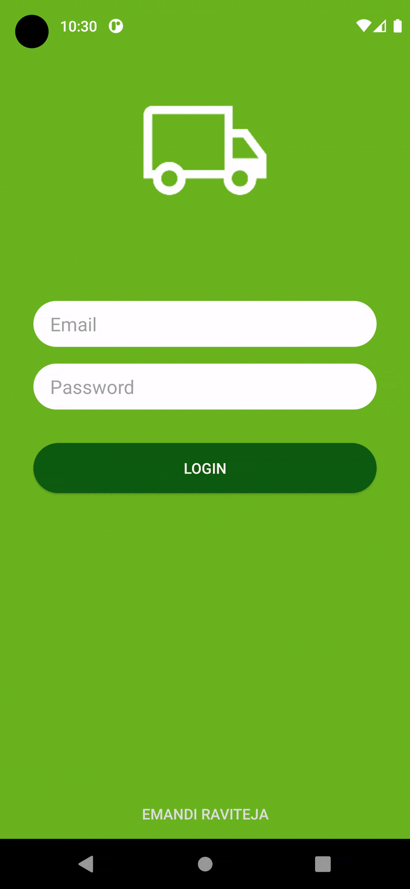

# ✅ RavTransition Button Library Android

---

**Preview**

### ⚡ Expand Animation



### ⚡ Shake Animation


---

### ⚡ Installation
**Gradle**
```
dependencies {
implementation 'com.royrodriguez:transitionbutton:0.2.0'
}
```

### ⚡ How to use
**Step 1**

Add the TransitonButton to your layout:
```
<com.royrodriguez.transitionbutton.TransitionButton
android:id="@+id/transition_button"
android:layout_width="match_parent"
android:layout_height="wrap_content"
android:text="Login"
<!-- Choose nice colors -->
app:defaultColor="@color/colorAppAccent"
app:loaderColor="@android:color/white"
android:textColor="@android:color/white" />
```

**Step 2**

Setup your code:

```
public class MainActivity extends AppCompatActivity {

    private TransitionButton transitionButton;

    @Override
    protected void onCreate(Bundle savedInstanceState) {
        super.onCreate(savedInstanceState);
        setContentView(R.layout.activity_main);
	
        transitionButton = findViewById(R.id.transition_button);
        transitionButton.setOnClickListener(new View.OnClickListener() {
            @Override
            public void onClick(View v) {
                // Start the loading animation when the user tap the button
                transitionButton.startAnimation();

                // Do your networking task or background work here.
                final Handler handler = new Handler();
                handler.postDelayed(new Runnable() {
                    @Override
                    public void run() {
                        boolean isSuccessful = true;
                        
			// Choose a stop animation if your call was succesful or not
                        if (isSuccessful) {
                            transitionButton.stopAnimation(TransitionButton.StopAnimationStyle.EXPAND, new TransitionButton.OnAnimationStopEndListener() {
                                @Override
                                public void onAnimationStopEnd() {
                                    Intent intent = new Intent(getBaseContext(), NewActivity.class);
                                    intent.addFlags(Intent.FLAG_ACTIVITY_NO_ANIMATION);
                                    startActivity(intent);
                                }
                            });
                        } else {
                            transitionButton.stopAnimation(TransitionButton.StopAnimationStyle.SHAKE, null);
                        }
                    }
                }, 2000);
            }
        });
    }
}
```